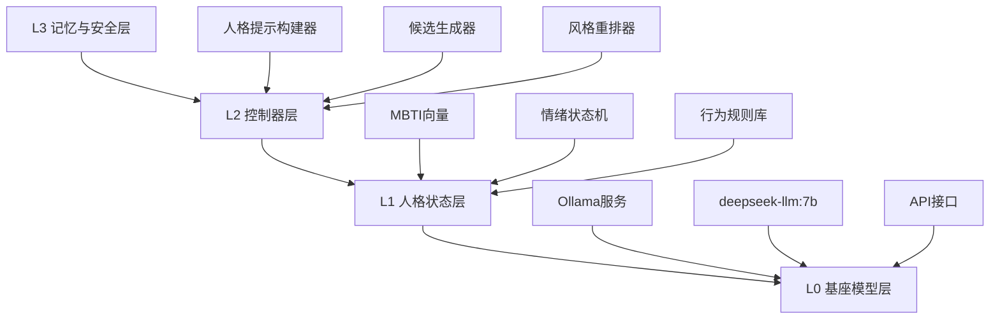
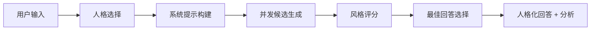

# MBTI-LLM: 零训练人格化语言模型

<div align="center">

[](README.md)
[](README_EN.md)

</div>

<div align="center">
  <h3>基于重排机制的MBTI人格化生成系统，无需训练即可让LLM呈现稳定的性格与情绪风格</h3>
</div>

---

## 核心特性

<table>
<tr>
<td width="25%" align="center"><strong>零训练实现</strong></td>
<td width="25%" align="center"><strong>人格稳定性</strong></td>
<td width="25%" align="center"><strong>本地部署</strong></td>
<td width="25%" align="center"><strong>可观测指标</strong></td>
</tr>
<tr>
<td>基于规则和重排，无需模型训练</td>
<td>通过风格评分器保证输出一致性</td>
<td>集成Ollama，支持离线运行</td>
<td>提供详细的人格匹配度分析</td>
</tr>
</table>

## 系统架构



## 支持的人格类型

<div align="center">

| 类型 | 特征 | 风格特点 |
|------|------|----------|
| **ENTJ** (执行官) | 领导力、效率导向 | 结论先行、行动导向、权威指导 |
| **INFP** (调停者) | 价值导向、共情能力 | 温和细腻、价值叙事、开放思考 |
| **ISTP** (虚拟家) | 实用主义、逻辑分析 | 务实客观、问题拆解、效果导向 |

</div>

## 快速开始

### 环境准备

```bash
# 安装Ollama (如果未安装)
curl -fsSL https://ollama.ai/install.sh | sh

# 下载推荐模型
ollama pull deepseek-llm:7b

# 启动Ollama服务
ollama serve
```

### 安装使用

```bash
# 克隆仓库
git clone https://github.com/Steven-ZN/MBTI-LLM.git
cd MBTI-LLM

# 安装依赖
pip install -r requirements.txt

# 环境配置
python setup.py
```

## 使用示例

<details>
<summary><strong>基础调用</strong></summary>

```python
from personality_controller import PersonalityController

# 初始化控制器
controller = PersonalityController()

# 生成ENTJ风格回答
result = controller.generate_with_personality(
    "如何提高团队效率？", 
    personality="ENTJ"
)

print(result["best_response"])
```

</details>

<details>
<summary><strong>人格对比</strong></summary>

```python
question = "如何学习一门新技术？"

for personality in ["ENTJ", "INFP", "ISTP"]:
    result = controller.generate_with_personality(question, personality)
    print(f"\n{personality}: {result['best_response']}")
```

</details>

<details>
<summary><strong>文本分析</strong></summary>

```python
text = "我觉得这个方案需要仔细考虑各方面的影响..."
analysis = controller.get_analysis(text, "INFP")
print(f"INFP匹配度: {analysis['overall_score']:.3f}")
```

</details>

## 核心组件

### 1. 人格规则映射 (`personality_rules.py`)
- MBTI四维度量化
- 可观测行为规则
- 词汇和结构偏好

### 2. 风格评分器 (`style_scorer.py`)
- 基于规则的匹配度计算
- 多维度综合评分
- 详细分析报告

### 3. 人格控制器 (`personality_controller.py`)
- 候选生成与重排
- Ollama集成
- 人格一致性保证

### 4. 人格模板 (`personality_templates.py`)
- 详细的语言风格定义
- 结构化模板
- 对比示例

## 评估指标

<div align="center">

| 指标 | 描述 | 范围 |
|------|------|------|
| **人格一致性** | 文本与目标人格的匹配度 | [0,1] |
| **可分辨性** | 不同人格输出的区分度 | 高/中/低 |
| **稳定性** | 多轮对话中的风格保持度 | 稳定/可变 |
| **流畅性** | 语言质量和可读性 | 自然/可接受/差 |

</div>

## 工作流程



## 配置选项

### 基座模型选择
```python
# 支持的Ollama模型
controller = PersonalityController(
    base_model="gpt-oss:20b",     # 你的本地模型
    # base_model="llama2:13b",    # 更大模型，更好质量
    # base_model="gemma:2b",      # 轻量模型，快速响应
)
```

### 生成参数调优
```python
result = controller.generate_with_personality(
    user_input,
    personality="ENTJ",
    num_candidates=5,    # 候选数量：越多越准确，但越慢
    return_all=True      # 返回所有候选及评分
)
```

## 应用场景

<table>
<tr>
<td><strong>虚拟助手</strong><br>为AI助手添加稳定人格特征</td>
<td><strong>内容创作</strong><br>生成不同风格的创作文案</td>
</tr>
<tr>
<td><strong>教育培训</strong><br>MBTI理论教学和实践体验</td>
<td><strong>研究工具</strong><br>人格计算和文本分析研究</td>
</tr>
</table>

## 扩展方向

### 短期优化
- [ ] 添加更多MBTI类型支持
- [ ] 情绪状态机集成
- [ ] 对话历史记忆

### 中期升级
- [ ] 训练专用风格评分器
- [ ] LoRA微调支持
- [ ] 多轮对话一致性

### 长期目标
- [ ] Big Five人格模型
- [ ] 个性化人格定制
- [ ] 实时风格自适应

## 技术细节

### 人格量化方法
```python
PersonalityProfile(
    mbti='ENTJ',
    e_score=0.8,   # 外向性 [-1,1]
    s_score=0.2,   # 感觉性 [-1,1] 
    t_score=0.9,   # 思考性 [-1,1]
    j_score=0.9,   # 判断性 [-1,1]
    valence=0.2,   # 情绪愉悦度
    arousal=0.7    # 情绪唤醒度
)
```

### 评分算法
```python
final_score = (
    sentence_structure * 0.3 +   # 句子结构
    vocabulary_match * 0.25 +    # 词汇匹配
    tone_consistency * 0.2 +     # 语调一致性
    length_style * 0.15 +        # 长度风格
    punctuation_style * 0.1      # 标点风格
)
```

## 贡献指南

欢迎提交PR和Issue！重点关注：
- 新的人格类型规则
- 评分算法优化
- 应用场景扩展
- 性能优化

## 许可证

MIT License - 详见 LICENSE 文件

## 致谢

- **Ollama项目** 提供本地LLM支持
- **MBTI理论** 为人格建模提供基础
- **开源社区** 提供各项依赖库支持

---

<div align="center">
  <sub>专为人格驱动的AI研究而构建</sub>
</div>