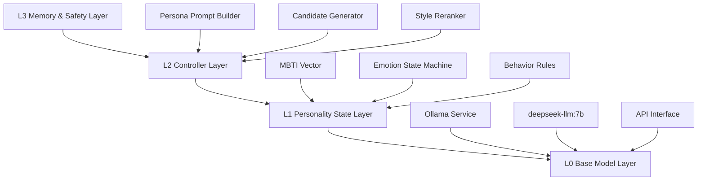
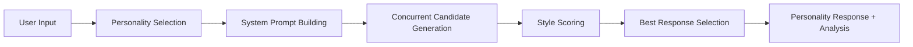

# MBTI-LLM: Zero-Training Personality Language Model

<div align="center">

[](README.md)
[](README_EN.md)

</div>

<div align="center">
  <h3>A reranking-based MBTI personality generation system that enables LLMs to exhibit stable personality and emotional styles without training</h3>
</div>

---

## Core Features

<table>
<tr>
<td width="25%" align="center"><strong>Zero Training</strong></td>
<td width="25%" align="center"><strong>Personality Stability</strong></td>
<td width="25%" align="center"><strong>Local Deployment</strong></td>
<td width="25%" align="center"><strong>Observable Metrics</strong></td>
</tr>
<tr>
<td>Rule-based + reranking without model training</td>
<td>Style scorer ensures output consistency</td>
<td>Ollama integration for offline operation</td>
<td>Detailed personality matching analysis</td>
</tr>
</table>

## System Architecture



## Supported Personality Types

<div align="center">

| Type | Characteristics | Style Features |
|------|----------------|----------------|
| **ENTJ** (Commander) | Leadership, Efficiency-focused | Conclusion-first, Action-oriented, Authoritative |
| **INFP** (Mediator) | Value-oriented, Empathetic | Gentle, Value-driven narrative, Open thinking |
| **ISTP** (Virtuoso) | Pragmatic, Logical analysis | Practical, Problem-decomposition, Result-oriented |

</div>

## Quick Start

### Prerequisites

```bash
# Install Ollama (if not installed)
curl -fsSL https://ollama.ai/install.sh | sh

# Download recommended model
ollama pull deepseek-llm:7b

# Start Ollama service
ollama serve
```

### Installation

```bash
# Clone repository
git clone https://github.com/Steven-ZN/MBTI-LLM.git
cd MBTI-LLM

# Install dependencies
pip install -r requirements.txt

# Environment setup
python setup.py
```

### Usage Examples

<details>
<summary><strong>Basic Usage</strong></summary>

```python
from personality_controller import PersonalityController

# Initialize controller
controller = PersonalityController()

# Generate ENTJ-style response
result = controller.generate_with_personality(
    "How to improve team efficiency?", 
    personality="ENTJ"
)

print(result["best_response"])
```

</details>

<details>
<summary><strong>Personality Comparison</strong></summary>

```python
question = "How to learn a new technology?"

for personality in ["ENTJ", "INFP", "ISTP"]:
    result = controller.generate_with_personality(question, personality)
    print(f"\n{personality}: {result['best_response']}")
```

</details>

<details>
<summary><strong>Text Analysis</strong></summary>

```python
text = "I think this solution needs careful consideration of all aspects..."
analysis = controller.get_analysis(text, "INFP")
print(f"INFP match score: {analysis['overall_score']:.3f}")
```

</details>

## Core Components

### 1. Personality Rules Mapping (`personality_rules.py`)
- **MBTI Four-dimensional Quantification**: E/I, S/N, T/F, J/P dimensions
- **Observable Behavior Rules**: Convert abstract traits to measurable language behaviors  
- **Vocabulary and Structure Preferences**: Specific word choices and sentence patterns

### 2. Style Scorer (`style_scorer.py`)
- **Rule-based Matching Calculation**: Multi-dimensional personality consistency scoring
- **Comprehensive Scoring**: Sentence structure, vocabulary, tone, length, punctuation
- **Detailed Analysis Reports**: Breakdown of matching performance

### 3. Personality Controller (`personality_controller.py`)
- **Concurrent Candidate Generation**: ThreadPool for parallel response generation
- **Intelligent Reranking**: Style-based candidate selection
- **Ollama Integration**: Seamless local model deployment

### 4. Personality Templates (`personality_templates.py`)
- **Detailed Style Definitions**: Comprehensive language style specifications
- **Structured Templates**: Organized behavioral patterns
- **Comparative Examples**: Side-by-side personality demonstrations

## Evaluation Metrics

<div align="center">

| Metric | Description | Range |
|--------|-------------|-------|
| **Personality Consistency** | Text-to-target personality matching | [0,1] |
| **Distinguishability** | Differentiation between personality outputs | High/Medium/Low |
| **Stability** | Style consistency across conversations | Stable/Variable |
| **Fluency** | Language quality and readability | Natural/Acceptable/Poor |

</div>

## Workflow Process



## Configuration Options

### Base Model Selection
```python
# Supported Ollama models
controller = PersonalityController(
    base_model="deepseek-llm:7b",    # Recommended: balanced performance
    # base_model="llama2:13b",       # Larger model, better quality
    # base_model="gemma:2b",         # Lightweight, faster response
)
```

### Generation Parameter Tuning
```python
result = controller.generate_with_personality(
    user_input,
    personality="ENTJ",
    num_candidates=5,    # More candidates = higher accuracy but slower
    return_all=True      # Return all candidates with scores
)
```

## Application Scenarios

<table>
<tr>
<td><strong>Virtual Assistants</strong><br>Add stable personality to AI assistants</td>
<td><strong>Content Creation</strong><br>Generate different writing styles</td>
</tr>
<tr>
<td><strong>Educational Training</strong><br>MBTI teaching and experience</td>
<td><strong>Research Tools</strong><br>Personality computation and text analysis</td>
</tr>
</table>

## Extension Roadmap

### Short-term Optimization
- [ ] Support for all 16 MBTI types
- [ ] Emotion state machine integration  
- [ ] Conversation history memory

### Medium-term Upgrades
- [ ] Dedicated style scorer training
- [ ] LoRA fine-tuning support
- [ ] Multi-turn conversation consistency

### Long-term Goals
- [ ] Big Five personality model
- [ ] Personalized personality customization
- [ ] Real-time style adaptation

## Technical Details

### Personality Quantification Method
```python
PersonalityProfile(
    mbti='ENTJ',
    e_score=0.8,   # Extraversion [-1,1]
    s_score=0.2,   # Sensing [-1,1] 
    t_score=0.9,   # Thinking [-1,1]
    j_score=0.9,   # Judging [-1,1]
    valence=0.2,   # Emotional valence
    arousal=0.7    # Emotional arousal
)
```

### Scoring Algorithm
```python
final_score = (
    sentence_structure * 0.3 +   # Sentence structure
    vocabulary_match * 0.25 +    # Vocabulary matching
    tone_consistency * 0.2 +     # Tone consistency
    length_style * 0.15 +        # Length style
    punctuation_style * 0.1      # Punctuation style
)
```

## Contributing

We welcome PRs and Issues! Focus areas:
- New personality type rules
- Scoring algorithm optimization
- Application scenario expansion
- Performance improvements

## License

MIT License - See LICENSE file for details

## Acknowledgments

- **Ollama Project** for local LLM support
- **MBTI Theory** for personality modeling foundation
- **Open Source Community** for various dependency libraries

---

<div align="center">
  <sub>Built with ❤️ for personality-driven AI research</sub>
</div>